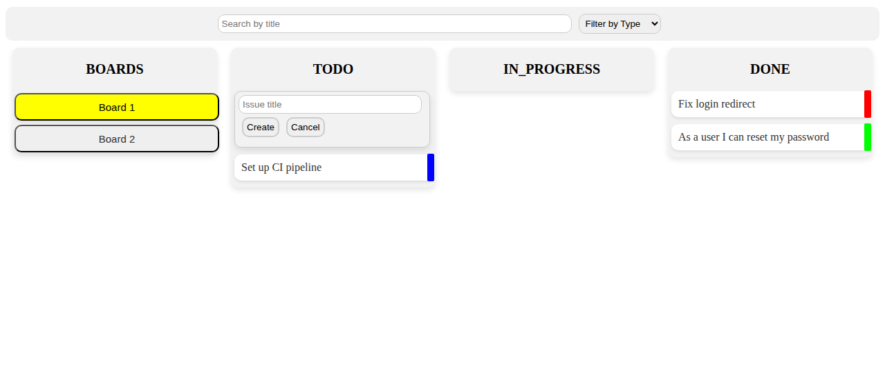

# Kanban Board

A Kanban board built with React for a university project at SUPSI.

**[Live demo](https://bossforcoding.github.io/kanban-board/)**



## Features

- Three columns: **TODO**, **IN_PROGRESS** and **DONE**, with drag and drop between them
- Three issue types: **Task**, **Bug** and **User Story**, each with its own color
- Multiple boards, with issues that can belong to more than one board
- Search by title and filter by issue type
- Two data modes:
  - **Local**: issues are passed as props and persisted in `localStorage` (used by the demo)
  - **Remote**: pass a `url` prop and the board reads and writes issues through a REST API

## Usage

```jsx
<MyBoard
  id="board-id"
  boards={[{ id: 1, name: 'Website' }]}
  issues={[{ id: 1, title: 'Set up CI', type: 'TASK', status: 'TODO', boards: [1] }]}
  search="true"
  boardsEnabled="true"
  onIssueClick={(issue) => console.log(issue)}
/>
```

## Getting started

Requires Node.js 18 or later.

```bash
npm install
npm run dev      # start the dev server
npm run build    # production build in dist/
```

## Tech stack

React 18 · Vite · CSS

## License

[MIT](LICENSE)
